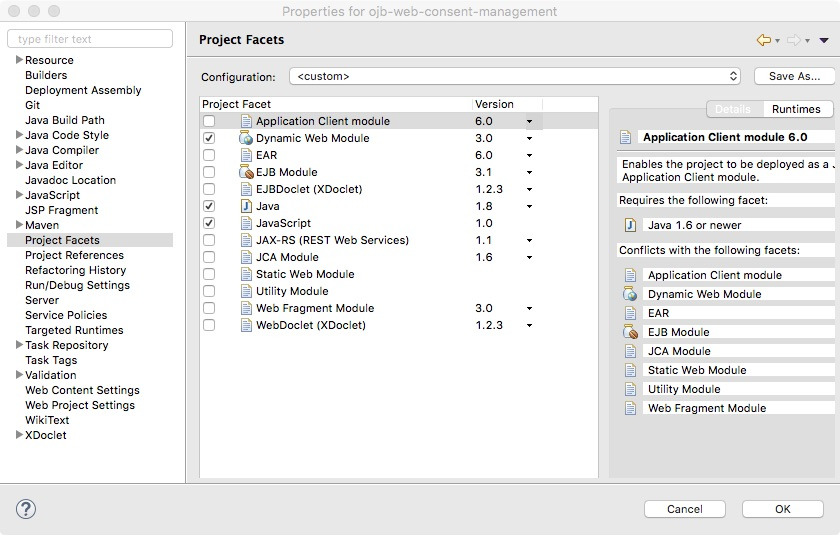
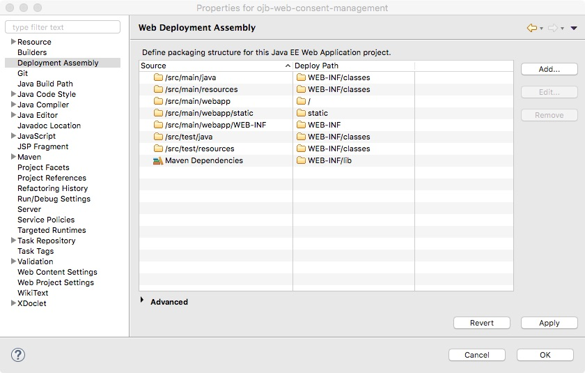

#### Consent Management Form Application

This project contains a J2EE web application, built with Spring Boot, for capturing inmate consent and sending associated
user actions to a REST API that handles them from there.

#### Setting up Eclipse to run application in Tomcat

1. Install the JST Server Adapters plugin via Eclipse Marketplace (this enables Tomcat as a server in WTP)
1. You'll need to install a new Server (via the Servers view in Eclipse).  Choose Tomcat 8.  Note that you will need to
point to a local Tomcat 8 installation, and it has to be 8.0 (not 8.1 or 8.5).
1. In the project (installed via Eclipse/maven) go to Project Properties and set up Project Facets like this:

1. Also in Project Properties, set up Deployment Assembly like this:

Now you should be able to run the project on the Tomcat server.